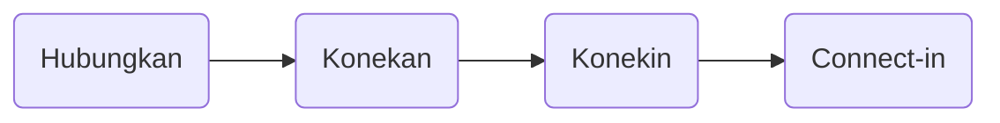

# `Connect-in` chat app

Merupakan web app untuk saling mengirim chat / pesan, baik secara publik maupun pribadi.

## Origin of the Name App

> Idenya buruk banget ya wkwkw :joy:

## Get Started

1. `git clone https://github.com/retry19/connectin-chat-app.git`

2. `cd connectin-chat-app`

3. `cp .env.example .env`

4. Isi environment variables yang dibutuhkan pada .env

5. `yarn start` :rocket:

## About

Reza Rachmanuddin
:copyright: 2021 
